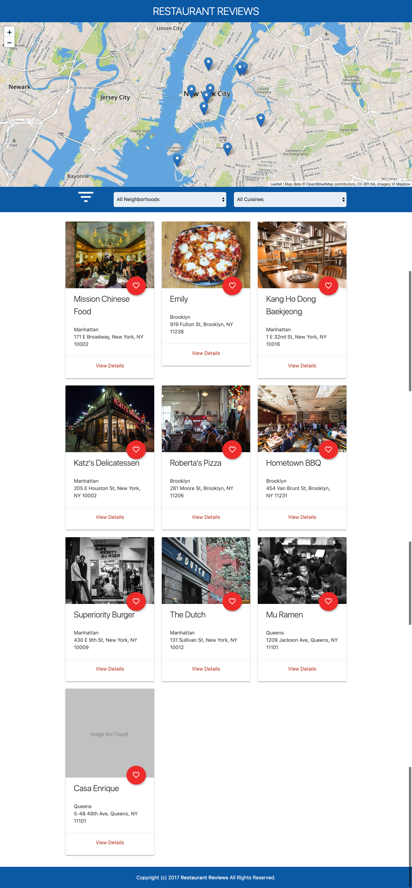

# MWS-Nanodegree-Projects
This repository has the project I have submitted for Udacity's **Mobile Web Specialist Nanodegree**.

This project is a simple Restaurant Reviews web app in directory `Restaurant Reviews App` written in HTML, CSS/SCSS and JavaScript. API server used for this app is in `Server` directory. Please open corresponding README files for more information.

## Screenshots

| Home Screen | Restaurant Details  |
|:-----------:|:-------------------:|
|  |  |


## Licence

The following notice is applicable to each project mentioned above.
```
This project was submitted by Rajanikant Deshmukh as part of the iOS Developer Nanodegree At Udacity.
As part of Udacity Honor code, your submissions must be your work, hence submitting this project
as yours will cause you to break the Udacity Honor Code moreover, the suspension of your account.
Me, the author of the project, allows you to check the code as a reference, but if you submit it,
it is your responsibility if you get expelled.
```
Besides the above notice, the MIT License must be included in all works derived from these projects. See [LICENCE](LICENSE) file for details.

## Certificate

You can see the certificate [here](https://confirm.udacity.com/JDL5NDKH).


## Other ND Projects
If you are interested you can check my other ND projects:
1. [Android Nanodegree Projects](https://github.com/aruke/Android-Nanodegree-Projects)
2. [iOS Nanodegree Projects](https://github.com/aruke/iOS-Nanodegree-Projects)
